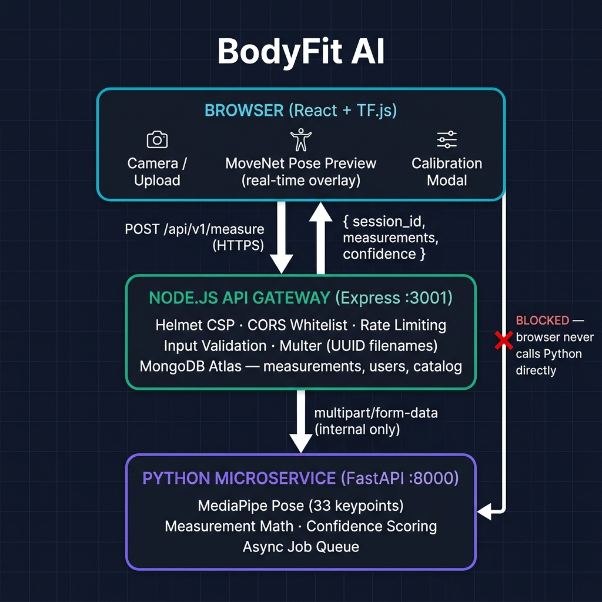

<p align="center">
  
  
  
  
  
  
  
</p>

<h1 align="center">BodyFit AI — Precision Body Measurement System</h1>

<p align="center">
  An AI-powered computer vision system that calculates precise body measurements from a photo or live camera feed — no tape measure required. Built for fashion technology, custom clothing design, and virtual try-on systems.
</p>

<p align="center">
  <a href="#-quick-start">Quick Start</a> •
  <a href="#-how-it-works">How It Works</a> •
  <a href="#-api-reference">API Reference</a> •
  <a href="#-project-structure">Project Structure</a> •
  <a href="#-deployment">Deployment</a> •
  <a href="#-contributing">Contributing</a>
</p>

---

## ✨ Key Features

| Feature | Description |
|---|---|
| 🤖 **AI-Powered Measurement** | TensorFlow.js MoveNet detects 17 body keypoints in the browser |
| 📷 **Dual Input Methods** | Live camera capture or photo upload — your choice |
| 📏 **Smart Calibration** | Height-based or reference object calibration for precise pixel-to-cm scaling |
| 📐 **8 Key Measurements** | Shoulder, chest, waist, hips, arm length, leg length, inseam, neck |
| 👗 **Clothing Recommendations** | Brand-aware size suggestions based on your measurements |
| 📈 **Progress Tracking** | Store and visualize measurement history over time |
| 📄 **PDF Export** | Download a professional measurement report |
| 🔒 **Security-First** | Helmet CSP headers, CORS whitelist, rate limiting, UUID temp filenames |
| 📱 **Fully Responsive** | Works on desktop, tablet, and mobile |

---

## 🏗️ System Architecture

The system is split into three clearly separated layers. **The browser handles real-time pose preview only. All final measurements come from the Python service via the Node.js gateway.**



```
┌─────────────────────────────────────────────────────────┐
│            BROWSER  (React + TF.js)                     │
│                                                         │
│  Camera / Upload → MoveNet pose preview overlay         │
│  Calibration Modal → send image + calibration to API    │
└────────────────────────┬────────────────────────────────┘
                         │ POST /api/v1/measure
                         ▼
┌─────────────────────────────────────────────────────────┐
│        NODE.JS API GATEWAY  (Express :3001)             │
│                                                         │
│  Rate limiting · CORS · Helmet · Input validation       │
│  Multer (UUID filenames) · Sharp image optimizer        │
│  MongoDB Atlas — measurements, sessions, catalog        │
└────────────────────────┬────────────────────────────────┘
                         │ multipart/form-data (internal only)
                         ▼
┌─────────────────────────────────────────────────────────┐
│        PYTHON MICROSERVICE  (FastAPI :8000)             │
│                                                         │
│  MediaPipe Pose (33 keypoints) · Calibration math       │
│  Elliptical circumference estimation · Confidence score │
│  Async job queue — POST returns job_id immediately      │
└─────────────────────────────────────────────────────────┘
```

> ⛔ **Service boundary rule:** The browser **never** calls the Python service directly.
> Port `8000` is a private internal service — only Node.js calls it.

### Request flow

```
User captures photo
  → Frontend sends image + calibration to POST /api/v1/measure
  → Node validates input, optimizes image with Sharp
  → Node proxies to Python FastAPI (returns job_id immediately — 202)
  → Python runs MediaPipe, computes measurements + confidence
  → Node saves result to MongoDB, returns full response
  → Frontend polls GET /api/v1/measure/:job_id until done
  → Results dashboard displayed
```

---

## 🚀 Quick Start

### Prerequisites

- **Node.js** v18 or higher
- **Python** 3.10 or higher (for the measurement microservice)
- **npm**
- **MongoDB Atlas** account (free tier works)
- A modern browser with camera support (Chrome recommended)

### 1 — Clone and install

```bash
git clone https://github.com/quantumNexus0/AI_Body_Measurement_System_for_Fashion_Technology.git
cd AI_Body_Measurement_System_for_Fashion_Technology

# Install frontend + root dependencies
# postinstall automatically installs server/ deps too
npm install
```

### 2 — Configure environment

```bash
# Copy the template and fill in your values
cp .env.example server/.env
```

Open `server/.env` and set:

```dotenv
PORT=3001
NODE_ENV=development
MONGODB_URI=mongodb+srv://<user>:<password>@cluster0.xxxxx.mongodb.net/bodyfitai
ALLOWED_ORIGINS=http://localhost:5173
PYTHON_SERVICE_URL=http://localhost:8000
```

> ⚠️ **Never commit your real `.env` file.** It is already listed in `.gitignore`.

### 3 — Start the Python microservice

```bash
cd python_backend
python -m venv venv
source venv/bin/activate          # Windows: venv\Scripts\activate
pip install -r requirements.txt
uvicorn main:app --port 8000 --reload
```

### 4 — Start the app

```bash
# From the project root — starts both Vite (:5173) and Express (:3001)
npm run dev
```

| Service | URL |
|---|---|
| Frontend | http://localhost:5173 |
| Backend API | http://localhost:3001 |
| Health Check | http://localhost:3001/api/health |
| Python Service (internal) | http://localhost:8000 |

---

## 📖 How to Use

### Method 1 — Camera Capture

1. Open the app and click the **Camera** tab
2. Grant camera permission when prompted
3. Position yourself so your **full body is visible** in the frame guide
4. Click **Capture Photo**
5. Complete the calibration step (enter your height)
6. Wait 2–5 seconds for AI processing
7. Review your measurements dashboard

### Method 2 — Image Upload

1. Click the **Upload** tab
2. Drag & drop or browse for a full-body photo
3. Preview and confirm the image
4. Complete calibration
5. Get instant measurements

### Calibration options

| Method | Reference | Accuracy |
|---|---|---|
| **Height** (recommended) | Your actual height in cm or inches | Highest |
| Smartphone | 15.5 cm / 6.1 in | High |
| Credit card | 8.5 cm / 3.35 in | High |
| A4 paper | 29.7 cm / 11.7 in | High |
| Custom object | Enter your own length | Varies |

### Tips for best results

- ✅ Stand against a **plain, light-coloured wall**
- ✅ Use **good, even lighting** (natural light or bright indoors)
- ✅ Wear **form-fitting clothing** (loose clothing adds error)
- ✅ Keep **full body in frame**, arms slightly away from body
- ✅ Stand **2 metres (6–7 ft)** from the camera
- ✅ Stand **straight**, looking forward

---

## 🔧 API Reference

All endpoints are versioned under `/api/v1/`.

### Health check

```http
GET /api/health
```

```json
{
  "success": true,
  "status": "healthy",
  "version": "1.0.0",
  "timestamp": "2025-01-01T00:00:00.000Z",
  "uptime_s": 3600,
  "service": "BodyFit AI Measurement API"
}
```

### Submit measurement

```http
POST /api/v1/measure
Content-Type: multipart/form-data
```

| Parameter | Type | Required | Description |
|---|---|---|---|
| `image` | file | ✅ | JPEG, PNG, or WebP — max 15 MB |
| `calibrationData` | string (JSON) | ✅ | Calibration object (see below) |
| `userId` | string | ❌ | MongoDB user ID for session linking |
| `notes` | string | ❌ | Free-text notes (max 500 chars) |

**Calibration object**

```json
{
  "type": "height",
  "value": 170,
  "unit": "cm"
}
```

**Success response (202 Accepted — async)**

```json
{
  "success": true,
  "data": {
    "job_id": "uuid-string",
    "status": "pending",
    "poll_url": "/api/v1/measure/uuid-string"
  },
  "error": null,
  "meta": { "processing_time_ms": 12, "model_version": "1.0.0" }
}
```

**Poll for result**

```http
GET /api/v1/measure/:job_id
```

```json
{
  "success": true,
  "data": {
    "job_id": "uuid-string",
    "status": "done",
    "measurements": {
      "shoulder_width": "45.2 cm",
      "chest": "95.8 cm",
      "waist": "80.1 cm",
      "hips": "100.3 cm",
      "arm_length": "65.7 cm",
      "leg_length": "95.4 cm",
      "inseam": "80.9 cm",
      "neck": "38.2 cm"
    }
  },
  "error": null,
  "meta": { "processing_time_ms": 1840, "model_version": "1.0.0", "confidence": 0.91 }
}
```

**Error response (422 — bad calibration input)**

```json
{
  "success": false,
  "data": null,
  "error": "user_height_cm must be between 50 and 250.",
  "meta": { "processing_time_ms": 12, "model_version": "1.0.0" }
}
```

### Get measurement history

```http
GET /api/v1/progress/:userId
```

### Get clothing recommendations

```http
POST /api/v1/recommendations
Content-Type: application/json

{ "measurements": { "chest": "95.8 cm", "waist": "80.1 cm" } }
```

---

## 📁 Project Structure

```
AI_Body_Measurement_System_for_Fashion_Technology/
│
├── 📁 src/                          # React + TypeScript frontend
│   ├── 📁 components/
│   │   ├── Header.tsx
│   │   ├── MeasurementCapture.tsx   # Main capture orchestrator
│   │   ├── CameraCapture.tsx        # Live camera + MoveNet preview
│   │   ├── ImageUpload.tsx          # Drag-and-drop upload
│   │   ├── CalibrationModal.tsx     # Calibration input + validation
│   │   └── Results.tsx              # Measurement results dashboard
│   ├── 📁 utils/
│   │   ├── poseDetector.ts          # TF.js MoveNet singleton loader
│   │   ├── calibration.ts           # Pixel-to-cm conversion logic
│   │   ├── measurementExtractor.ts  # Geometry math on keypoints
│   │   ├── bodyShapeClassifier.ts   # Hourglass / pear / apple etc.
│   │   └── recommendationEngine.ts  # Brand size matching
│   ├── 📁 data/
│   │   └── brands.json              # Size charts for 10+ brands
│   ├── App.tsx
│   ├── main.tsx
│   └── index.css
│
├── 📁 server/                       # Node.js + Express API gateway
│   ├── index.js                     # App entry — security, routing, preflight
│   ├── 📁 config/
│   │   └── db.js                    # MongoDB Atlas connection
│   ├── 📁 controllers/
│   │   ├── measureController.js     # Progress + recommendations logic
│   │   └── userController.js        # User CRUD
│   ├── 📁 middleware/
│   │   └── validator.js             # express-validator schemas
│   ├── 📁 models/
│   │   ├── Measurement.js           # session_id, measurements{}, confidence…
│   │   ├── User.js                  # name, email, gender, height, weight
│   │   └── ClothingItem.js          # Clothing catalog schema
│   ├── 📁 routes/
│   │   └── v1/index.js              # All /api/v1/* routes + Python proxy
│   ├── 📁 utils/
│   │   └── seedDatabase.js          # Seed clothing catalog on startup
│   ├── 📁 temp/                     # UUID-named upload buffer (auto-cleaned)
│   └── package.json
│
├── 📁 python_backend/               # FastAPI measurement microservice
│   ├── main.py                      # FastAPI app, async job queue
│   ├── models.py                    # Pydantic V2 data models
│   ├── database.py                  # Motor async MongoDB connection
│   ├── response_utils.py            # Standard response envelope
│   └── requirements.txt             # Pinned Python dependencies
│
├── 📁 docs/
│   └── architecture_diagram.png    # System architecture diagram
│
├── .env.example                     # Environment variable template
├── .gitignore
├── setup.sh                         # First-time setup script
├── package.json                     # Root — frontend deps + postinstall
├── vite.config.ts                   # Vite config + /api proxy to :3001
├── tailwind.config.js
├── tsconfig.json
├── ARCHITECTURE.md                  # Full architecture decision record
├── DEPLOYMENT.md
└── README.md
```

---

## 🛠️ Technology Stack

| Layer | Technology | Version | Purpose |
|---|---|---|---|
| **Frontend** | React | 18.3.1 | Component-based UI |
| | TypeScript | 5.5.3 | Type safety |
| | Tailwind CSS | 3.4.1 | Utility-first styling |
| | Vite | 5.4.2 | Build tool & dev server |
| **AI / ML** | TensorFlow.js | 4.15.0 | In-browser ML runtime |
| | MoveNet Thunder | — | 17-keypoint pose detection (still images, browser) |
| | MoveNet Lightning | — | Real-time camera preview overlay (browser) |
| | MediaPipe Pose | 0.10.9 | 33-keypoint server-side detection (Python) |
| **Backend** | Node.js + Express | 20 / 4.x | API gateway |
| | MongoDB + Mongoose | Atlas | Measurements, sessions, catalog |
| | Multer | 1.4.x | Multipart upload (in-memory, UUID filenames) |
| | Helmet | 7.x | HTTP security headers + CSP |
| | express-rate-limit | 7.x | Request rate control |
| **Python service** | FastAPI | 0.111 | Async measurement microservice |
| | Pydantic | V2 | Request validation |
| | Motor | 3.x | Async MongoDB driver |
| | MediaPipe | 0.10.9 | Pose landmark detection |
| **Utilities** | jsPDF | 3.x | PDF report generation |
| | Lucide React | 0.344 | Icon library |
| | concurrently | 8.x | Run frontend + backend together |

---

## 🔒 Data Storage & Privacy

### What IS stored (MongoDB Atlas)

| Collection | Fields | Purpose |
|---|---|---|
| `measurements` | `session_id`, `timestamp`, `measurements{}`, `calibration_method`, `confidence`, `notes` | Progress tracking & history |
| `users` | `name`, `email`, `gender`, `height`, `weight` | Optional account linking |
| `clothingitems` | Brand catalog data | Recommendations engine |

### What is NOT stored

- **Raw images are never persisted.** Uploaded files are held in-memory by multer, forwarded to the Python service, then garbage-collected — regardless of success or failure.
- **No biometric identifiers** (face data, fingerprints) are stored or processed.
- **Anonymous sessions are fully supported.** The `user` field on `measurements` is optional; unregistered users receive a `session_id` only.

### Security measures in place

- **Helmet** — strict Content Security Policy on every response
- **CORS whitelist** — only `ALLOWED_ORIGINS` may call the API
- **Rate limiting** — 60 req/min general, 10 req/min on `/measure`
- **UUID filenames** — uploaded files are never saved with their original name
- **Input validation** — out-of-range values rejected with HTTP 422
- **Preflight env check** — server exits immediately if required env vars are missing
- **Temp cleanup** — files older than 1 hour purged on startup and every 30 min
- **HTTPS required** in production for camera access

---

## 🌐 Deployment

### Environment variables (production)

```dotenv
PORT=3001
NODE_ENV=production
MONGODB_URI=mongodb+srv://<user>:<password>@cluster0.xxxxx.mongodb.net/bodyfitai
ALLOWED_ORIGINS=https://yourdomain.com
PYTHON_SERVICE_URL=https://your-python-service.internal
```

### Option 1 — Vercel + Railway (recommended)

| Service | Deploy to |
|---|---|
| Frontend (React) | [Vercel](https://vercel.com) — connect GitHub repo, auto-deploy |
| Node.js API | [Railway](https://railway.app) — Node buildpack |
| Python service | Railway — Python buildpack |

### Option 2 — Docker Compose

```bash
docker compose up --build
```

### Build for production manually

```bash
# Frontend
npm run build           # outputs to dist/

# Backend
cd server && npm install --production

# Python
cd python_backend
pip install -r requirements.txt
uvicorn main:app --host 0.0.0.0 --port 8000
```

---

## 🎯 Measurement Accuracy

| Measurement | Range (cm) | Range (inches) |
|---|---|---|
| Shoulder width | 35 – 60 cm | 14 – 24 in |
| Chest circumference | 70 – 140 cm | 28 – 55 in |
| Waist circumference | 60 – 120 cm | 24 – 47 in |
| Hip circumference | 80 – 130 cm | 31 – 51 in |
| Arm length | 50 – 80 cm | 20 – 31 in |
| Leg length | 70 – 110 cm | 28 – 43 in |
| Inseam | 60 – 95 cm | 24 – 37 in |
| Neck circumference | 30 – 50 cm | 12 – 20 in |

**Accuracy notes:**
- **Width measurements** (shoulder, waist, hips): ±1–2 cm under optimal conditions
- **Circumference measurements**: ±3–5 cm — estimated via anthropometric depth ratios from a single front-view image. A side-view photo improves this significantly.
- **Upload limit**: 15 MB (JPEG / PNG / WebP)

---

## 🧪 Testing

```bash
# TypeScript type check
npx tsc --noEmit

# ESLint
npm run lint

# API health smoke test
node server/tests/test-validation.js
```

### Manual test checklist

| Condition | Expected result |
|---|---|
| ✅ Full body, good light, plain wall | All 8 measurements, confidence > 0.85 |
| ⚠️ Partial body (feet cut off) | Inseam / leg flagged as unavailable |
| ⚠️ Low light | Lower keypoint confidence, warnings shown |
| ❌ No body detected | Error: "No person detected in image" |
| ❌ Height = 17 (typo for 170) | 422: "height must be between 50 and 250 cm" |

---

## 🐛 Troubleshooting

| Problem | Fix |
|---|---|
| Camera not working | Grant permission in browser settings. HTTPS required in production. |
| Measurements look wrong | Check calibration value. Ensure full body is in frame. |
| Server won't start | Check that `PORT`, `NODE_ENV`, `MONGODB_URI`, `ALLOWED_ORIGINS` are set in `server/.env`. |
| Python service errors | Activate venv then `pip install -r python_backend/requirements.txt`. |
| Build errors | `rm -rf node_modules && npm install` |
| Port already in use | `lsof -ti:3001 \| xargs kill` then restart |

---

## 📊 Performance

| Metric | Value |
|---|---|
| Processing time | 2 – 5 seconds per image |
| Model load (MoveNet Thunder) | ~3 s first load, cached thereafter |
| API rate limit | 10 measurement requests / minute |
| Max image upload | 15 MB |
| Browser support | Chrome, Firefox, Safari, Edge (latest 2 versions) |
| Mobile support | iOS Safari 15+, Chrome Mobile |

---

## 🔮 Roadmap

- [ ] Side-view photo support for accurate circumference measurements
- [ ] Body shape classifier with style tips (hourglass, pear, apple, rectangle)
- [ ] Real brand size chart database (Zara, H&M, Allen Solly, Manyavar, Levi's…)
- [ ] Measurement progress charts (body over time)
- [ ] GitHub Actions CI pipeline (type check + lint + build on every PR)
- [ ] Docker Compose production config
- [ ] Native iOS / Android app

---

## 🤝 Contributing

Contributions are welcome! Please read [CONTRIBUTING.md](CONTRIBUTING.md) first.

```bash
# 1. Fork and clone your fork
git clone https://github.com/YOUR_USERNAME/AI_Body_Measurement_System_for_Fashion_Technology.git

# 2. Create a feature branch
git checkout -b feature/your-feature-name

# 3. Verify everything passes
npm run lint && npx tsc --noEmit

# 4. Commit with a descriptive message
git commit -m "feat: add side-view calibration support"

# 5. Push and open a PR
git push origin feature/your-feature-name
```

### Commit message convention

| Prefix | Use for |
|---|---|
| `feat:` | New feature |
| `fix:` | Bug fix |
| `docs:` | Documentation only |
| `refactor:` | Code restructure, no behaviour change |
| `test:` | Adding or fixing tests |
| `chore:` | Build, deps, config |
| `arch:` | Architecture / service boundary changes |
| `dx:` | Developer experience improvements |

---

## 📄 License

This project is licensed under the **MIT License** — see [LICENSE](LICENSE) for details.

---

## 🙏 Acknowledgments

- [TensorFlow.js](https://www.tensorflow.org/js) — in-browser ML runtime
- [MediaPipe](https://mediapipe.dev) — pose landmark detection
- [FastAPI](https://fastapi.tiangolo.com) — Python microservice framework
- [React](https://react.dev) — UI framework
- [MongoDB Atlas](https://www.mongodb.com/atlas) — managed database

---

## 📞 Support

- **GitHub Issues**: [Open an issue](https://github.com/quantumNexus0/AI_Body_Measurement_System_for_Fashion_Technology/issues)
- **Email**: vipulyadav503@gmail.com

---

<p align="center">Made with ❤️ for the fashion technology community</p>
<p align="center">⭐ Star this repo if you find it helpful!</p>
