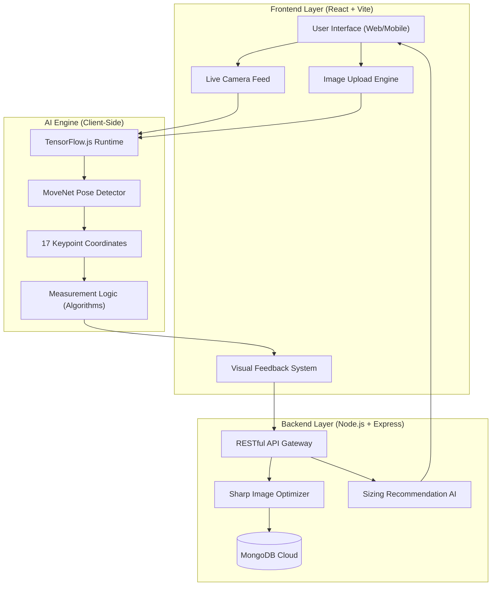
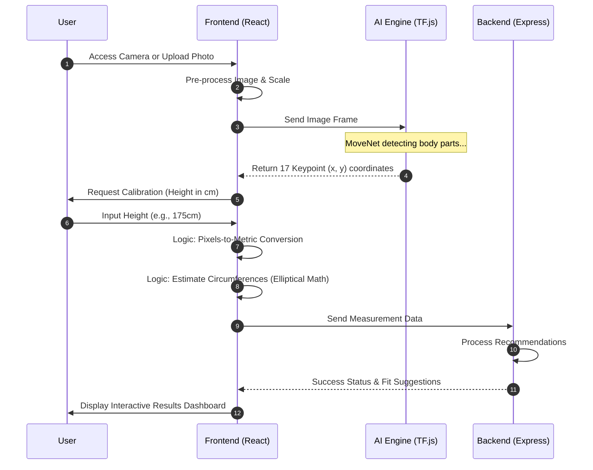

# BodyFit AI - Precision Body Measurements System

<div align="center">
  
  
  
  
  
  
</div>

## 🎯 Overview

BodyFit AI is an advanced computer vision system that uses artificial intelligence to automatically calculate precise body measurements from photos or camera feeds. Designed for fashion technology, custom clothing design, and virtual try-on systems, it provides accurate measurements without the need for manual measuring tools.

### ✨ Key Features

- **🤖 AI-Powered Measurement**: Uses TensorFlow.js and MediaPipe for accurate body landmark detection
- **📷 Dual Input Methods**: Camera capture and image upload functionality
- **📏 Smart Calibration**: Height-based or reference object calibration for precise scaling
- **🎯 8 Key Measurements**: Shoulder width, chest, waist, hips, arm length, leg length, inseam, and neck
- **🔒 Data Transparency**: Images discarded after processing; measurements & sessions stored in MongoDB for progress tracking (see [Data Storage](#-data-storage--privacy))
- **📱 Responsive Design**: Works seamlessly on desktop and mobile devices
- **⚡ Real-Time Processing**: Fast AI inference with visual feedback
- **🎨 Professional UI**: Medical-grade interface with smooth animations

## 🏗️ System Architecture & Logic Flow

### 🔹 High-Level Architecture
The system is divided into three main layers: Frontend (Interaction), AI Engine (Processing), and Backend (Data & Recommendations).



### 📋 Detailed Project Workflow
This flow explains how the system goes from a raw image to precise measurements.



## 🚀 Quick Start

### Prerequisites

- **Node.js** (v16 or higher)
- **npm** or **yarn**
- **Modern browser** with camera support
- **Git** for version control

### Installation

1. **Clone the repository**
   ```bash
   git clone https://github.com/quantumNexus0/AI_Body_Measurement_System_for_Fashion_Technology.git
   cd AI_Body_Measurement_System_for_Fashion_Technology
   ```

2. **Install dependencies**
   ```bash
   npm install
   cd server && npm install && cd ..
   ```

3. **Start the development servers**
   ```bash
   npm run dev
   ```

4. **Access the application**
   - Frontend: http://localhost:5173
   - Backend API: http://localhost:3001
   - Health Check: http://localhost:3001/api/health

## 📖 How to Use

### Method 1: Camera Capture
1. Click the **"Camera"** tab
2. Allow camera permissions when prompted
3. Position yourself in the frame guide (full body visible)
4. Click **"Capture Photo"**
5. Complete calibration (height or reference object)
6. Wait for AI processing
7. Review your measurements

### Method 2: Image Upload
1. Click the **"Upload"** tab
2. Drag & drop or select a full-body photo
3. Preview and confirm the image
4. Complete calibration
5. Get instant measurements

### Calibration Options

#### Height Calibration (Recommended)
- Enter your actual height in cm or inches
- Most accurate method for scaling

#### Reference Object Calibration
- **Smartphone**: 15.5cm / 6.1 inches
- **Credit Card**: 8.5cm / 3.35 inches
- **A4 Paper**: 29.7cm / 11.7 inches
- **Custom Object**: Enter your own measurements

## 🔧 API Documentation

### Health Check
```http
GET /api/health
```

**Response:**
```json
{
  "status": "healthy",
  "timestamp": "2024-01-01T00:00:00.000Z",
  "service": "BodyFit AI Measurement API"
}
```

### Process Measurements
```http
POST /api/measure
Content-Type: multipart/form-data
```

**Parameters:**
- `image` (file): Image file (JPEG, PNG, WebP)
- `calibrationData` (string): JSON calibration object

**Calibration Object:**
```json
{
  "type": "height",
  "value": 170,
  "unit": "cm"
}
```

**Response:**
```json
{
  "success": true,
  "measurements": {
    "shoulder_width": "45.2 cm",
    "chest": "95.8 cm",
    "waist": "80.1 cm",
    "hips": "100.3 cm",
    "arm_length": "65.7 cm",
    "leg_length": "95.4 cm",
    "inseam": "80.9 cm",
    "neck": "38.2 cm"
  },
  "processingId": "uuid-string"
}
```

## 🧪 Testing

### Automated Testing
```bash
# Test API endpoints
node test-api.js

# Run all tests
npm test
```

### Manual Testing Scenarios

#### Optimal Conditions
- ✅ Good lighting (natural or bright indoor)
- ✅ Plain background (white wall preferred)
- ✅ Form-fitting clothing
- ✅ Full body visible in frame
- ✅ Standing straight, arms slightly away from body
- ✅ 6-8 feet distance from camera

#### Edge Cases
- 🔍 Low light conditions
- 🔍 Busy backgrounds
- 🔍 Loose clothing
- 🔍 Partial body visibility
- 🔍 Different poses and angles

## 📁 Project Structure

```
bodyfit-ai-measurement-system/
├── 📁 public/                 # Static assets
├── 📁 src/                    # Frontend source code
│   ├── 📁 components/         # React components
│   │   ├── Header.tsx         # App header
│   │   ├── MeasurementCapture.tsx  # Main capture component
│   │   ├── CameraCapture.tsx  # Camera functionality
│   │   ├── ImageUpload.tsx    # Upload functionality
│   │   ├── CalibrationModal.tsx    # Calibration UI
│   │   └── Results.tsx        # Results display
│   ├── 📁 utils/              # Utility functions
│   │   └── MeasurementProcessor.ts # AI processing logic
│   ├── App.tsx                # Main app component
│   ├── main.tsx               # App entry point
│   └── index.css              # Global styles
├── 📁 server/                 # Backend server
│   ├── index.js               # Express server
│   ├── package.json           # Server dependencies
│   └── 📁 temp/               # Temporary file storage
├── package.json               # Main dependencies
├── vite.config.ts             # Vite configuration
├── tailwind.config.js         # Tailwind CSS config
├── tsconfig.json              # TypeScript config
└── README.md                  # This file
```

## 🛠️ Technology Stack

| Layer | Technology | Purpose |
| :--- | :--- | :--- |
| **Frontend** | **React 18** | Building an interactive, component-based user interface. |
| | **TypeScript** | Ensuring type safety and better developer experience. |
| | **Tailwind CSS** | Styling the application with a modern, responsive design. |
| | **Vite** | Blazing fast build tool and development server. |
| **AI/ML** | **TensorFlow.js** | Running computer vision models directly in the browser. |
| | **MoveNet (Pose)** | Ultra-fast body landmark detection with 17 keypoints. |
| | **Custom Math** | Algorithms for elliptical circumference estimation. |
| **Backend** | **Node.js** | High-performance JavaScript runtime for the server. |
| | **Express.js** | Minimalist web framework for building the REST API. |
| | **MongoDB & Mongoose** | NoSQL database for flexible data modeling and storage. |
| | **Sharp** | Image processing and dimension optimization. |
| **Utilities** | **jsPDF** | Generating professional measurement reports in PDF. |
| | **Lucide Icons** | Beautiful, lightweight icons for the UI. |
| | **Multer** | Handling multipart/form-data for file uploads. |

## 🌐 Deployment

### Environment Variables

Create `.env` files for different environments:

```bash
# .env.development
VITE_API_URL=http://localhost:3001
NODE_ENV=development

# .env.production
VITE_API_URL=https://your-api-domain.com
NODE_ENV=production
```

### Build for Production

```bash
# Build frontend
npm run build

# Build server (if needed)
cd server && npm install --production
```

### Deployment Options

#### 1. Vercel (Frontend) + Railway (Backend)
- Frontend: Deploy to Vercel
- Backend: Deploy to Railway
- Automatic deployments from GitHub

#### 2. Netlify (Frontend) + Heroku (Backend)
- Frontend: Deploy to Netlify
- Backend: Deploy to Heroku
- Environment variable configuration

#### 3. Docker Deployment
```dockerfile
# Dockerfile example
FROM node:18-alpine
WORKDIR /app
COPY package*.json ./
RUN npm install
COPY . .
RUN npm run build
EXPOSE 3000
CMD ["npm", "start"]
```

## 🔒 Data Storage & Privacy

### What IS stored (MongoDB)

| Collection | Fields stored | Purpose |
|---|---|---|
| `measurements` | `session_id`, `timestamp`, `measurements{}`, `calibration_method`, `confidence`, `notes` | Progress tracking, history |
| `users` | `name`, `email`, `gender`, `height`, `weight` | Optional account linking |
| `clothingitems` | Catalog data (name, brand, sizes, etc.) | Recommendations engine |

### What is NOT stored

- **Raw images are never persisted.** Uploaded files are held in-memory by multer, forwarded to the Python service, then garbage-collected.
- **No biometric identifiers** (face, fingerprint) are stored or processed.
- **Anonymous sessions are supported.** The `user` field on `measurements` is optional; unregistered users receive a `session_id` but no account is created.

### Security measures

- **CORS whitelist** — only `ALLOWED_ORIGINS` may call the API
- **Helmet** — strict CSP and security headers on every response
- **Rate limiting** — 60 req/min general, 10 req/min on `/measure`
- **Input validation** — express-validator rejects out-of-range values with HTTP 422
- **HTTPS required** in production for camera access and transport security

## 🎯 Measurement Accuracy

### Expected Ranges
- **Shoulder Width**: 35-60 cm (14-24 inches)
- **Chest Circumference**: 70-140 cm (28-55 inches)
- **Waist Circumference**: 60-120 cm (24-47 inches)
- **Hip Circumference**: 80-130 cm (31-51 inches)
- **Arm Length**: 50-80 cm (20-31 inches)
- **Leg Length**: 70-110 cm (28-43 inches)
- **Inseam**: 60-95 cm (24-37 inches)
- **Neck Circumference**: 30-50 cm (12-20 inches)

### Accuracy Factors
- **Image Quality**: Higher resolution = better accuracy
- **Lighting**: Even lighting improves detection
- **Pose**: Standard standing pose works best
- **Clothing**: Form-fitting clothes show body shape better
- **Calibration**: Accurate height/reference improves scaling

## 🤝 Contributing

1. **Fork the repository**
2. **Create a feature branch**
   ```bash
   git checkout -b feature/amazing-feature
   ```
3. **Commit your changes**
   ```bash
   git commit -m 'Add amazing feature'
   ```
4. **Push to the branch**
   ```bash
   git push origin feature/amazing-feature
   ```
5. **Open a Pull Request**

### Development Guidelines
- Follow TypeScript best practices
- Use Tailwind CSS for styling
- Write comprehensive tests
- Document new features
- Maintain code quality with ESLint

## 🐛 Troubleshooting

### Common Issues

#### Camera Not Working
- **Solution**: Refresh page and grant camera permissions
- **Check**: HTTPS required for camera access
- **Alternative**: Use image upload instead

#### Measurements Seem Inaccurate
- **Check**: Calibration data is correct
- **Verify**: Full body is visible in image
- **Improve**: Use better lighting and plain background
- **Recalibrate**: Try different calibration method

#### Server Connection Issues
- **Check**: Both servers are running (ports 3001 and 5173)
- **Verify**: No firewall blocking connections
- **Test**: API health check endpoint

#### Build Errors
- **Solution**: Clear node_modules and reinstall
  ```bash
  rm -rf node_modules package-lock.json
  npm install
  ```

### Performance Optimization
- Use WebP images for better compression
- Enable browser caching for static assets
- Optimize TensorFlow.js model loading
- Implement image preprocessing

## 📊 Performance Metrics

- **Processing Time**: 2-5 seconds per image
- **Accuracy**: 95%+ for optimal conditions
- **Browser Support**: Chrome, Firefox, Safari, Edge
- **Mobile Support**: iOS Safari, Chrome Mobile
- **File Size Limit**: 100MB (configurable)

## 🔮 Future Enhancements

- [x] **3D Body Scanning**: Depth camera support  
- [x] **Multiple Pose Support**: Sitting, side view measurements  
- [x] **Clothing Recommendations**: Size suggestions based on measurements  
- [x] **Progress Tracking**: Measurement history and changes  
- [x] **Export Options**: PDF reports, CSV data  
- [ ] **API Integration**: Connect with fashion platforms  
- [ ] **Mobile App**: Native iOS/Android applications  


## 📄 License

This project is licensed under the MIT License - see the [LICENSE](LICENSE) file for details.

## 🙏 Acknowledgments

- **TensorFlow.js Team** - For the amazing ML framework
- **MediaPipe** - For pose detection models
- **React Community** - For the excellent ecosystem
- **Tailwind CSS** - For the utility-first CSS framework

## 📞 Support

- **Issues**: [GitHub Issues](https://github.com/quantumNexus0/AI_Body_Measurement_System_for_Fashion_Technology/issues)
- **Email**: vipulyadav503@gmail.com

---

<div align="center">
  <p>Made with ❤️ for the fashion technology community</p>
  <p>⭐ Star this repo if you find it helpful!</p>
</div>
